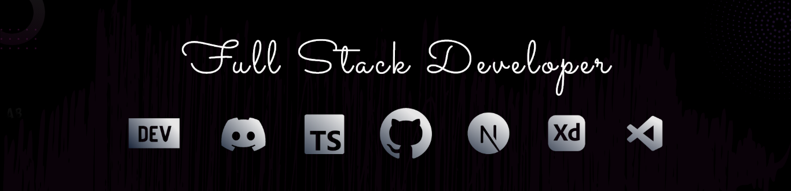

;

<h1 align="center">Hi 👋, I'm Durgesh Chaudhari</h1>
<h3 align="center">A passionate Software Engineer from India</h3>

  

- 🌱 I’m currently learning **React.js, Vue.js, Angular.js**

- 💬 Ask me about **react, vue, gsap, node.js, express.js, database**

- 📫 How to reach me **durgeshchaudhari199@gmail.com**

- ⚡ Fun fact **🎶 Besides building web applications, I love creating music on my guitar—coding and chords are my favorite combo!**

<h3 align="left">Connect with me:</h3>

